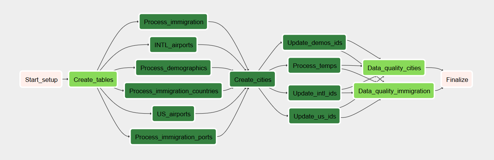

# City Database
### Data Engineering Capstone Write-Up

## 1) Project Goal: Construct a City Information Database

This project aims to synthesize various data sources relating to cities, mainly in the United States, into a clean and organized database.
This database can be used for analytics purposes, or even as features in ML/DL projects.

Datasets include:

    - immigration (i94) 
    - airport-codes 
    - population and demographics
    - temperature

The complete database will be able to answer questions such as:

    - is there more immigration to warmer cities?
    - are warmer cities more diverse?
    - do more diverse cities have higher rates of immigration?
    - are immigrants from certain countries favoring certain climes or cities more than others? 

#### Dataset Descriptions

- Immigration (i94): file comes from US government. [Info here.](https://travel.trade.gov/research/reports/i94/historical/2016.html)
    This dataset contains information on arrivals to the United States, with the origin country, arrival location (port), visa status, etc. 
    - Port to city mapping is stored in the i94_locs.csv file, which was copied from the I94_SAS_labels file and cleaned up in Visual Studio Code
    - Country code mapping is stored in the i94_countriess.csv file,which was copied from the I94_SAS_labels file and cleaned up in Visual Studio Code

- Airports: data comes from [Datahub](https://datahub.io/core/airport-codes#data)
    - Airport demographic information, such as elevation, name, type, municipality, and lat/long coordinates are contained here. Will have to filter dataseet to only include US airports.

- U.S. City Demographic Data: dataset comes from [the Federal Government via OpenSoft](https://public.opendatasoft.com/explore/dataset/us-cities-demographics/export/)
    - Data taken from the US Census Bureau's 2015 American Community Survey
    - Contains population counts, such as total population, number of males, females, etc, as well as race/ethnicity demographics
    
    
- World Temperature Data: comes from [Kaggle](https://www.kaggle.com/berkeleyearth/climate-change-earth-surface-temperature-data#GlobalLandTemperaturesByCity.csv)
    - contains the date, city name, lat/long, average temperature in celsius, and the temperature measurement uncertainty
    - as it is time series, data will be aggregated at a city+time interval level, probably seasonal or monthly
    - trends can be calculated as well using the aggregated data

## 2) Tools/Technology Rationale

Tools used in this project include:

    - Redshift/PostgresSQL as the database (will provide database creation code and workflow)
    - Python for ETL
    - Spark for ETL
    - Airflow for scheduling and pipelining
    - Visual Studio Code as text editor, to create csv files from text/sas files

##### Python
I use Python for all of the heavy lifting in data processing, the pandas and pyspark libraries in particular.
Pandas makes it quick and easy to process small-medium size datasets, while PySpark does the heavy lifting for the Immigration file data processing, as it is the largest amount of record by far.

##### Database Choice
Redshift provides the cloud database, and while it is not free like Postgres is, query performance is quicker due to its column-based architecture. Given that none of the tables in this database will have an exorbinant amount of columns (where Redshift slows down), this is a fine choice for cloud storage.

##### Airflow - Scheduling and Pipelining
As this database only needs to be set up once, given it is based on static files, Airflow does not make much sense for this project, if only setting up once.
However, I saw this as an opportunity to get a better understanding of Airflow, and built the pipeline with the final data model in mind.
Getting Airflow set up and building the custom operators took more work than buidling out the singular ETL functions- if this process were to be repeated it would save a lot of time.

## 3) ETL Process

#### Data Model

The database will consist of the following tables:

    - cities: guide for filtering the other tables. Rows with Port_ID are present in the immigration table 
    - intl_airports: international airports, with coordinates, country, city_ID/name, and airport name and type
    - us_airports: airports in the US with coordinates, city_ID/name, type, and airport name
    - demographics: contains population demographic data, in the form of counts and as percentages. 
    - city_temps: time-series table of temperature readings for municipalities in the cities table.
    - immigration: immigration events with all descriptive data possible, like entry date, entry port, states visited, etc. 
    - immigration_ports: city-name mapping for Port_ID in the immigration table.
    - immigration_countries: country-name mapping for citizen_country_id and residence_country_id cols in immigration table.

In general, you can use City_ID when present to join across tables. The only tables without it are immigration and the immigration port/countries tables.
To join other tables with immigration tables, use the Port_ID in the cities table as the mapping to City_ID. Not all cities in the database have immigration data.
 
 
#### Pipeline

## 4) How Often Should the Data be Updated?

This data comes from mostly static or dimension data- the exceptions being Immigration and temperature files.
Each month, the new Immigration file would be run through the Immigration ETL function and appended to the table, ditto for the city_temps table. 
The demographics table might need to be refreshed (dropped and re-uploaded) if a more recent version was obtained by the organization.
The airports data can change if new airports go into business or others close- that refresh would be infrequent as well.

## 5) How Would Approach this problem under the following scenarios:

**a) If the data was increased by 100x**

The ETL processes (with the exception of immigration) would have to be transitioned from using pandas to mainly using PySpark.
I'd add code as part of the pipeline that would spin up an EMR cluster, and rebuild the operators to use Spark, just like the SparksToRedshiftOperator.

**b) If the pipelines were run on a daily basis by 7am**
    
As I built the pipeline in Airflow, all we would have to do is schedule the the pipeline to run sometime before 7, perhaps at 1 AM.
I'd also add in settings to prevent the processing from continuing past 7 AM or after some interval (1 hour for example) and log it.

**c) If the database needed to be accessed by 100+ people**

 The final database is Redshift, so if there were 100+ users accessing it at once, we might have to spin up a larger cluster that could handle that volume.
That process is simple- AWS lets you scale up or down clusters using the same settings, but we'd have to take backups first. 

